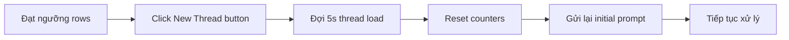

# 🧪 Test Mode - Hướng Dẫn Sử Dụng

## Tổng Quan

Extension hỗ trợ **2 chế độ xử lý**:

| Chế độ | Rows/Thread | Mục đích |
|--------|-------------|----------|
| **Production Mode** | 50 rows | Xử lý thực tế, tối ưu hiệu suất |
| **Test Mode** | 5 rows | Testing, debugging, kiểm tra nhanh |

---

## Cách Bật Test Mode

### Bước 1: Mở Extension Popup
Click vào icon extension trên Chrome toolbar

### Bước 2: Tick Checkbox "Test mode (5 rows/thread)"


### Bước 3: Load Part và Start Processing
- Chọn Part file (1-12)
- Click "Load Part"
- Click "Start"

---

## Cách Hoạt Động

### Production Mode (Mặc định)
```
Row 1-50   → Thread 1
Row 51-100 → Thread 2 (NEW THREAD)
Row 101-150 → Thread 3 (NEW THREAD)
...
```

### Test Mode
```
Row 1-5   → Thread 1
Row 6-10  → Thread 2 (NEW THREAD)
Row 11-15 → Thread 3 (NEW THREAD)
...
```

---

## Khi Nào Tạo NEW THREAD?

Extension tự động tạo thread mới trong **2 trường hợp**:

### 1. Scheduled (Theo lịch)
- **Production**: Sau mỗi 50 rows
- **Test**: Sau mỗi 5 rows

### 2. Emergency (Khẩn cấp)
- Khi AI không trả về JSON code block
- Khi timeout 60s không có response

---

## Quy Trình Tạo NEW THREAD



**Chi tiết:**
1. Click XPath: `(//button[@data-testid="sidebar-new-thread"])[1]`
2. Đợi 5s để thread mới load
3. Reset tất cả counters:
   - `markdownCounter = 0`
   - `rowsProcessedInCurrentThread = 0`
   - `promptSent = false`
4. Gửi lại initial prompt từ `promptForce.md`
5. Đợi 10s → `markdown-0` được tạo (skip)
6. Tiếp tục xử lý rows

---

## Logs Hiển Thị

### Production Mode
```
Test mode: OFF (50 rows/thread)
✅ Processed row 1/200
✅ Processed row 2/200
...
✅ Processed row 50/200
Creating new thread after 50 rows
```

### Test Mode
```
Test mode: ON (5 rows/thread)
✅ Processed row 1/200
✅ Processed row 2/200
...
✅ Processed row 5/200
Creating new thread after 5 rows
```

---

## Code Implementation

### 1. UI Checkbox (excelPopup.tsx)
```tsx
<Checkbox
  label="Test mode (5 rows/thread)"
  checked={state.testMode}
  onChange={(e) => setState(prev => ({ 
    ...prev, 
    testMode: e.currentTarget.checked 
  }))}
  size="xs"
/>
```

### 2. Truyền testMode vào Background (excelPopup.tsx)
```tsx
const startResponse = await chrome.runtime.sendMessage({
  type: 'START_PROCESSING',
  payload: {
    threadId: createResponse.threadId,
    testMode: state.testMode  // ← Truyền testMode
  }
});
```

### 3. Background Nhận testMode (background.ts)
```typescript
case MessageType.START_PROCESSING: {
  const threadId = message.payload?.threadId;
  const testMode = message.payload?.testMode;
  await backgroundProcessor.startProcessing(threadId, testMode);
  break;
}
```

### 4. BackgroundProcessor Set rowsPerThread (backgroundProcessor.ts)
```typescript
async startProcessing(threadId?: string, testMode?: boolean): Promise<void> {
  if (testMode !== undefined) {
    this.state.testMode = testMode;
    this.state.rowsPerThread = testMode
      ? EXCEL_CONFIG.ROWS_PER_THREAD_TEST      // 5
      : EXCEL_CONFIG.ROWS_PER_THREAD_PRODUCTION; // 50
    this.addLog(`Test mode: ${testMode ? 'ON (5 rows/thread)' : 'OFF (50 rows/thread)'}`, 'info');
  }
}
```

### 5. Kiểm Tra Điều Kiện NEW THREAD (backgroundProcessor.ts)
```typescript
// Check if need new thread (every N rows based on mode)
const rowsInCurrentThread = thread.processedRows % this.state.rowsPerThread;
if (rowsInCurrentThread === 0 && thread.currentRowIndex < thread.totalRows) {
  this.addLog(`Creating new thread after ${this.state.rowsPerThread} rows`, 'info');
  await this.createNewThread();
}
```

### 6. Constants (constants.ts)
```typescript
export const EXCEL_CONFIG = {
  TEST_MODE: false,
  ROWS_PER_THREAD_TEST: 5,
  ROWS_PER_THREAD_PRODUCTION: 50,
  ...
}
```

---

## Lưu Ý Quan Trọng

### ⚠️ Test Mode Chỉ Dùng Để Testing
- **KHÔNG** dùng test mode cho production
- Tạo quá nhiều threads có thể trigger rate limiting của Perplexity
- Test mode tốn thời gian hơn (nhiều lần gửi initial prompt)

### ✅ Khi Nào Dùng Test Mode?
- Debug logic xử lý rows
- Kiểm tra new thread creation
- Test với dataset nhỏ
- Verify AI response parsing

### ✅ Khi Nào Dùng Production Mode?
- Xử lý thực tế với 1000+ rows
- Tối ưu hiệu suất
- Giảm số lần tạo thread
- Tránh rate limiting

---

## Troubleshooting

### Vấn đề: Test mode không hoạt động
**Giải pháp:**
1. Kiểm tra checkbox đã được tick chưa
2. Xem logs có hiển thị "Test mode: ON (5 rows/thread)" không
3. Reload extension và thử lại

### Vấn đề: Vẫn tạo thread sau 50 rows dù đã bật test mode
**Giải pháp:**
1. Stop processing
2. Reload extension
3. Tick lại checkbox test mode
4. Start lại

### Vấn đề: Quá nhiều threads được tạo
**Nguyên nhân:**
- AI không trả về JSON code block → Trigger emergency new thread
- Timeout 60s → Trigger emergency new thread

**Giải pháp:**
- Kiểm tra prompt trong `promptForce.md`
- Verify AI response format
- Tăng timeout nếu cần

---

## Summary

✅ **Feature đã hoàn chỉnh** - Không cần code thêm gì!

**Cách sử dụng:**
1. Tick checkbox "Test mode (5 rows/thread)"
2. Load Part
3. Start Processing
4. Xem logs để verify: "Test mode: ON (5 rows/thread)"
5. Sau mỗi 5 rows sẽ thấy log: "Creating new thread after 5 rows"

**Lợi ích:**
- Testing nhanh với dataset nhỏ
- Debug logic dễ dàng hơn
- Verify new thread creation
- Không cần modify code để test

